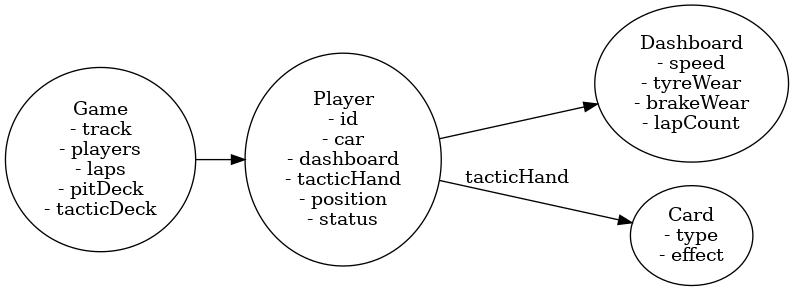

# Waddington’s Formula 1 – Digital Remake Developer Documentation

## Overview
This document provides the structured ruleset, system design, and implementation guidance for recreating *Waddington’s Formula 1* as a digital/web-based game.  
The original 1960s board game mechanics are translated here into programmable structures, UI flows, and logical sequences.

---

## 1. Game Overview
- Racing strategy game where movement is deterministic (based on speedometer), not dice.  
- Dice are used **only for penalties** when exceeding corner safety speeds.  
- Objective: Complete the set number of laps (minimum 3) and cross the finish line first.  

---

## 2. Components
- **Race Track Board** (with straights, corners, pits, red safety bands, penalty chart)  
- **6 Dashboards** (tracking speed, tyre wear, brake wear, lap count)  
- **6 Racing Cars** (Yellow, Orange, Green, Red, Black, Blue)  
- **2 Dice** (used only for penalties)  
- **Tactic Cards** (special abilities)  
- **Pit Cards** (random pit-stop effects)  

---

## 3. Setup
1. **Choose Cars**: Players roll dice; highest roll chooses first, then clockwise.  
2. **Starting Grid**: Cars are placed on grid in this order:  
   1st = Yellow, 2nd = Orange, 3rd = Green, 4th = Red, 5th = Black, 6th = Blue.  
3. **Dashboards**: Each player sets speedometer = 0, tyre wear = 0, brake wear = 0, lap indicator = chosen laps (≥ 3).  
4. **Cards**: Shuffle pit deck face-down, shuffle tactic cards and deal 5 to each player.  
5. **Dice**: Set aside until needed for penalties.  

---

## 4. Movement
- 1 square = 20 mph.  
- Speed may increase by 20/40/60 mph per turn, but never more than +60 mph.  
- Deceleration allowed but may incur brake/tyre wear (see reduction rules).  
- Movement examples:  
  - 20 mph = 1 square  
  - 40 mph = 2 squares  
  - 60 mph = 3 squares  
  - 80 mph = 4 squares, etc.  
- Only one car per square; cars cannot jump over others.  
- Direction: forward only (straight or diagonal).  

---

## 5. Corners & Hazards
- Corners marked by **red bands** with safety speeds.  
- At/below safety speed: no penalty.  
- Overspeeding:  
  - +10 or +20 mph: roll dice, apply penalty chart.  
  - +40 mph: roll dice with higher penalty chance.  
  - +60 mph+: automatic spin-off.  
- If crossing multiple red bands in one move, roll separately for each.  

---

## 6. Penalties & Spin-Offs
### Spin-off conditions
- Exceed safety speed by ≥ 60 mph.  
- Forced deceleration > 20 mph when brakes are maxed out.  
- Crossing a corner while tyre wear = 8.  
- Certain penalty dice outcomes.  

### Spin-off resolution
- Car placed on nearest spin-off point (or outside of track if due to baulking).  
- Speedometer reset to 0.  
- Tyre/brake wear unchanged.  
- Next turn, car restarts at 60 mph.  

---

## 7. Speed Reduction & Wear
- −20 mph: no wear.  
- −40 mph: brake wear only.  
- −60 mph or more: brake + tyre wear.  
- Tyre wear max = 8. At max, cars may only reduce by −40 mph.  

---

## 8. Lap Indicator
- Records laps completed.  
- Set to chosen number at race start.  
- Decreases by 1 when crossing finish line.  
- Race ends when indicator reaches 0.  

---

## 9. Baulking (Blocking)
- Cars can block others at corners or narrow sections.  
- Baulked car must move up to square directly behind blocker.  
- Speed reduced to blocker’s speed (apply wear penalties).  
- If blocker is faster, baulked car may accelerate up to blocker’s speed (≤ +60 mph), but no extra movement.  
- If baulked in pits/spin-off, speedometer can reset to 60 mph for restart.  

---

## 10. Pits
- Must stop exactly on own pit square; overshooting means continuing.  
- Effects: reset brakes, tyres, and speedometer to 0 (lap unchanged).  
- Draw 1 pit card and apply effect before exiting.  
- Exit pits next turn at 60 mph.  

---

## 11. Tactic Cards
- Each player starts with 5 cards.  
- Played for extra moves or cornering advantages.  
- Normally used **after movement but before dice roll**.  
- Exception: *Superb Driving* is played before movement.  
- Only 1 tactic card per turn.  
- Discard after use.  

---

## 12. Finishing & Winning
- Car finishes by crossing finish line after required laps.  
- All players complete the same number of turns.  
- Winner = furthest past finish line after final turn.  

---

## 13. Championship Mode (Optional)
Points awarded per race:  
- 1st = 10 points  
- 2nd = 8 points  
- 3rd = 6 points  
- 4th = 4 points  
- 5th = 2 points  
- 6th = 1 point  
Champion = driver with most cumulative points after multiple races.  

---

## 14. Key Mechanics Summary
- Deterministic movement.  
- Dice used for penalties only.  
- Risk/reward trade-offs in cornering.  
- Resource management: tyres, brakes.  
- Tactical blocking and pit strategy.  
- Tactic cards add unpredictability.  

---

## System Design

### Data Structures

### UI Layout

### Logic Flow (Per Turn)

### Movement & Penalty Tracking

---

## Implementation Notes
- **Game State**: Central object holding track, players, laps, pit deck, tactic deck.  
- **Player State**: Car + dashboard (speed, wear, laps) + tactic cards.  
- **Turn Sequence**: Adjust speed → move → check hazards → roll penalties → apply wear → tactic card → next player.  
- **UI**: Dashboards interactive; dice rolls & penalties clearly displayed.  
- **Persistence**: Championship mode should persist scores.  

---

## Development Roadmap
- Phase 1: Core speed/movement mechanics.  
- Phase 2: Corners, hazards, penalties, wear tracking.  
- Phase 3: Tactic and pit cards.  
- Phase 4: Baulking & multiplayer.  
- Phase 5: Championship/league system.  

---
